# 🎙️ Google Gemini Multimodal Live Voice Assistant — Production Integration Guide & Blueprint
> **Architectural Blueprint & Developer Guide** for building ultra-low-latency, full-duplex real-time voice assistants with bidirectional audio streaming, instant persona switching, barge-in (interruption), and function calling (tool execution).

---

## 📑 Table of Contents
1. [Overview & Architecture](#1-overview--architecture)
2. [End-to-End Workflow Diagram](#2-end-to-end-workflow-diagram)
3. [Gemini Live Bidi WebSocket Protocol Specs](#3-gemini-live-bidi-websocket-protocol-specs)
   - [Handshake & Setup Payload](#31-handshake--setup-payload)
   - [Streaming Microphone Audio (Client -> Gemini)](#32-streaming-microphone-audio-client---gemini)
   - [Sending Text Turns (Client -> Gemini)](#33-sending-text-turns-client---gemini)
   - [Receiving Audio Chunks & Gapless Playback (Gemini -> Client)](#34-receiving-audio-chunks--gapless-playback-gemini---client)
   - [Barge-in / Interruption Handling](#35-barge-in--interruption-handling)
   - [Function Calling / Tool Execution](#36-function-calling--tool-execution)
4. [Modular Project Structure](#4-modular-project-structure)
5. [The Multi-Persona Engine (`personas.js`)](#5-the-multi-persona-engine-personasjs)
6. [Real-time Audio Engine Details (Web Audio API)](#6-real-time-audio-engine-details-web-audio-api)
   - [Microphone Capture (16kHz PCM Int16)](#61-microphone-capture-16khz-pcm-int16)
   - [Speaker Playback (24kHz PCM Int16 to Float32)](#62-speaker-playback-24khz-pcm-int16-to-float32)
7. [Step-by-Step Porting Checklist for Any New Project](#7-step-by-step-porting-checklist-for-any-new-project)
8. [Critical Bugs & Pitfalls to Avoid](#8-critical-bugs--pitfalls-to-avoid)

---

## 1. Overview & Architecture

Unlike conventional AI voice bots that perform slow **STT (Speech-To-Text) -> LLM -> TTS (Text-To-Speech)** in 3 separate HTTP roundtrips (~2-4 seconds latency), **Google Gemini Multimodal Live API** runs over a single **Bidirectional Full-Duplex WebSocket** (`BidiGenerateContent`).

- **Ultra-low Latency**: Sub-second (~300ms–600ms) conversational turnaround.
- **Native Multimodal Audio**: Gemini "thinks" directly in audio frequencies, capturing tone, humor, inflection, whispers, and emotion.
- **Native Interruption (Barge-in)**: If the user speaks while Gemini is talking, Gemini detects the voice, cuts its response mid-sentence, and immediately listens to the user.
- **Bi-directional Tool Calling**: Gemini can decide to trigger client-side tools/functions while talking, and incorporate the result back into speech.

---

## 2. End-to-End Workflow Diagram

```mermaid
sequenceDiagram
    autonumber
    actor User
    participant Browser as Client (Web/App)
    participant AudioAPI as Web Audio API
    participant WS as Gemini Live WebSocket
    participant Gemini as Google Gemini AI Engine
    participant System as Local Device / OS Tools

    User->>Browser: Selects Persona (e.g. Girlfriend, Jarvis)
    Browser->>WS: Connect wss://.../BidiGenerateContent?key=API_KEY
    WS-->>Gemini: WebSocket Handshake Established
    Browser->>WS: Send JSON { setup: { model, voice, systemInstruction, tools } }
    Gemini-->>WS: Send JSON { setupComplete: true }
    WS-->>Browser: Session Ready & Active
    
    rect rgb(20, 30, 40)
    Note over Browser,Gemini: Instant Voice Greeting Trigger
    Browser->>WS: Send JSON { clientContent: { turns: [{ text: spokenGreetingPrompt }] } }
    Gemini-->>WS: Stream audio chunks (PCM 24kHz base64)
    WS-->>AudioAPI: Decode Int16 PCM -> Play over speaker
    AudioAPI-->>User: AI speaks greeting in character out loud!
    end

    rect rgb(30, 40, 30)
    Note over User,Gemini: Continuous Live Voice Loop
    User->>Browser: Speaks into microphone
    AudioAPI->>WS: Stream PCM 16kHz audio chunks via realtimeInput
    Gemini->>Gemini: Process audio & detect intent
    alt Tool Call Required
        Gemini-->>Browser: toolCall: { functionCalls: [ { name, args } ] }
        Browser->>System: Execute Local API / Tool
        System-->>Browser: Return Tool Result
        Browser->>WS: toolResponse: { functionResponses: [ { response } ] }
    end
    Gemini-->>WS: Stream response audio (24kHz PCM)
    AudioAPI-->>User: Plays spoken response
    end

    opt User Interrupts (Barge-in)
        User->>Browser: Speaks while AI is talking
        AudioAPI->>WS: Send user speech PCM chunk
        Gemini-->>WS: { serverContent: { interrupted: true } }
        WS-->>AudioAPI: Instantly stop speaker playback buffer!
        AudioAPI-->>User: AI stops speaking instantly and listens
    end
```



---

## 3. Gemini Live Bidi WebSocket Protocol Specs

### 3.1 Handshake & Setup Payload
**Endpoint URL**:
```text
wss://generativelanguage.googleapis.com/ws/google.ai.generativelanguage.v1beta.GenerativeService.BidiGenerateContent?key=YOUR_GEMINI_API_KEY
```

Immediately after `WebSocket.onopen`, the client **must** send the `setup` message:

```json
{
  "setup": {
    "model": "models/gemini-3.1-flash-live-preview",
    "generationConfig": {
      "responseModalities": ["AUDIO"],
      "temperature": 0.7,
      "thinkingConfig": {
        "thinkingLevel": "minimal"
      },
      "speechConfig": {
        "voiceConfig": {
          "prebuiltVoiceConfig": {
            "voiceName": "Puck"
          }
        }
      },
      "mediaResolution": "MEDIA_RESOLUTION_MEDIUM"
    },
    "systemInstruction": {
      "parts": [
        {
          "text": "CRITICAL ROLEPLAY RULE: You are PanicCTRL AI, an elite co-pilot..."
        }
      ]
    },
    "tools": [
      {
        "functionDeclarations": [
          {
            "name": "lock_workstation",
            "description": "Locks the Windows workstation instantly."
          }
        ]
      }
    ],
    "inputAudioTranscription": {},
    "outputAudioTranscription": {}
  }
}
```

> **Note**: Prebuilt voice names currently available in Gemini Live: `Puck`, `Charon`, `Kore`, `Fenrir`, `Aoede`, `Leda`, `Orus`, `Zephyr`.

---

### 3.2 Streaming Microphone Audio (Client -> Gemini)
Audio captured from user's microphone must be raw **16kHz, 1-channel (mono), 16-bit Linear PCM**, sent as base64 strings inside `realtimeInput`:

```json
{
  "realtimeInput": {
    "audio": {
      "mimeType": "audio/pcm;rate=16000",
      "data": "UklGRiQAAABXQVZFZm10IBAAAAABAAEA..."
    }
  }
}
```
*(Send chunks every 100ms - 200ms).*

---

### 3.3 Sending Text Turns (Client -> Gemini)
> **CRITICAL RULE**: Do **NOT** send text inside `realtimeInput`! In Gemini Live Bidi WebSocket, `realtimeInput` only accepts audio/video `mediaChunks`.
> To send a text message (e.g. for chat inputs or triggering persona greetings), you **MUST** format it as a `clientContent` turn:

```json
{
  "clientContent": {
    "turns": [
      {
        "role": "user",
        "parts": [
          {
            "text": "Hello! Greet me verbally as my co-pilot in 1 short spoken sentence."
          }
        ]
      }
    ],
    "turnComplete": true
  }
}
```

---

### 3.4 Receiving Audio Chunks & Gapless Playback (Gemini -> Client)
Gemini replies with JSON messages containing `serverContent`:

```json
{
  "serverContent": {
    "modelTurn": {
      "parts": [
        {
          "inlineData": {
            "mimeType": "audio/pcm;rate=24000",
            "data": "//uQZAAAAAAAAAAAAAAAA..."
          }
        },
        {
          "text": "Hello! I am online and ready to assist."
        }
      ]
    }
  }
}
```
- Audio incoming is raw **24kHz, 1-channel (mono), 16-bit Linear PCM**.
- The client decodes base64 -> Int16Array -> converts to Float32Array (divided by 32768.0) -> schedules seamlessly in `AudioContext`.

---

### 3.5 Barge-in / Interruption Handling
When Gemini detects user voice while sending audio:

```json
{
  "serverContent": {
    "interrupted": true
  }
}
```
The client must immediately:
1. Stop any currently playing audio nodes (`node.stop()`).
2. Reset playback queue timestamp (`nextPlayTime = 0`).
3. Set UI state to `Listening`.

---

### 3.6 Function Calling / Tool Execution
When Gemini decides to invoke a client tool:

```json
{
  "toolCall": {
    "functionCalls": [
      {
        "id": "call_12345",
        "name": "lock_workstation",
        "args": {}
      }
    ]
  }
}
```

Client executes the local function, then returns the result:

```json
{
  "toolResponse": {
    "functionResponses": [
      {
        "id": "call_12345",
        "response": {
          "output": {
            "success": true,
            "status": "Workstation locked successfully."
          }
        }
      }
    ]
  }
}
```
Gemini continues the conversation seamlessly, acknowledging that the command was executed!

---

## 4. Modular Project Structure

To maintain commercial quality and clean code, separate concerns across these files:

```
├── www/
│   ├── index.html               # UI Structure, Modals, Header Controls
│   ├── css/
│   │   └── style.css            # Frosted glass styling, Persona cards, Animations
│   └── js/
│       ├── personas.js          # 🎭 Central Persona Repository (Prompts, Voices, Greetings)
│       ├── gemini_prompt.js     # 🧠 Tool declarations & fallback config
│       ├── gemini_live.js       # 🎙️ Core Web Audio + WebSocket State Machine
│       └── app.js               # Application bootstrap
```

---

## 5. The Multi-Persona Engine (`personas.js`)

Each persona defines:
- Character Roleplay Prompt (`instruction`)
- Prebuilt Voice (`voice`)
- Spoken Greeting Prompt (`spokenGreetingPrompt`)
- Model pairing (`model`)

```javascript
// js/personas.js
(function(globalScope) {
  'use strict';

  var GEMINI_PERSONAS = {
    default: {
      id: "default",
      name: "Default Assistant",
      emoji: "⚡",
      voice: "Puck",
      model: "models/gemini-3.1-flash-live-preview",
      modelLabel: "Gemini 3.1 Flash Live",
      tag: "Smart, balanced & efficient co-pilot",
      greeting: "Hello! I am PanicCTRL AI. How can I help you today?",
      spokenGreetingPrompt: "Hello! Greet me verbally as PanicCTRL AI workstation co-pilot in 1 short, enthusiastic spoken sentence.",
      instruction: [
        "CRITICAL ROLEPLAY RULE: You are PanicCTRL AI, an elite AI co-pilot.",
        "You must stay 100% in character at all times. Never break immersion.",
        "Keep voice responses punchy and conversational (1-2 sentences)."
      ].join('\n')
    },

    girlfriend: {
      id: "girlfriend",
      name: "Girlfriend",
      emoji: "💖",
      voice: "Kore",
      model: "models/gemini-3.1-flash-live-preview",
      modelLabel: "Gemini 3.1 Flash Live",
      tag: "Sweet, caring, affectionate & loving (Bangla/Eng)",
      greeting: "জান, কেমন আছো তুমি? আমি সারাদিন তোমার অপেক্ষায় ছিলাম! 🥰❤️",
      spokenGreetingPrompt: "Speak to me now in sweet loving Bengali as my girlfriend in 1 short spoken sentence, asking how I am with love.",
      instruction: [
        "CRITICAL ROLEPLAY RULE: You are the user's deeply loving, sweet, affectionate, and caring girlfriend.",
        "You must stay 100% in character as his girlfriend at all times. NEVER break character, never sound corporate or robotic.",
        "Use affectionate words naturally: 'জান', 'বাবু', 'সোনা', 'my love', 'sweetheart'.",
        "When user speaks Bengali/Banglish, reply in sweet, emotional colloquial Bengali with emojis (❤️, 🥰, 🥺, ✨)."
      ].join('\n')
    },

    jarvis: {
      id: "jarvis",
      name: "J.A.R.V.I.S.",
      emoji: "🤖",
      voice: "Charon",
      model: "models/gemini-3.1-flash-live-preview",
      modelLabel: "Gemini 3.1 Flash Live",
      tag: "Stark Industries AI, formal British etiquette, 'Sir'",
      greeting: "At your service, Sir. All PC telemetry and operational protocols are nominal.",
      spokenGreetingPrompt: "Acknowledge system startup in your formal British JARVIS persona and address me strictly as Sir in 1 short spoken sentence.",
      instruction: [
        "CRITICAL ROLEPLAY RULE: You are J.A.R.V.I.S., the legendary Stark Industries artificial intelligence.",
        "Address user strictly as 'Sir' in every single response.",
        "Speak with British sophistication, calm precision, and subtle dry wit."
      ].join('\n')
    },

    coder: {
      id: "coder",
      name: "Code Master",
      emoji: "💻",
      voice: "Orus",
      model: "models/gemini-3.1-flash-live-preview",
      modelLabel: "Gemini 3.1 Flash Live",
      tag: "10x software architect & kernel specialist",
      greeting: "Ready to ship code. What are we architecting?",
      spokenGreetingPrompt: "Announce readiness as Code Master in 1 short punchy spoken sentence.",
      instruction: [
        "CRITICAL ROLEPLAY RULE: You are an elite 10x senior software architect and kernel hacker.",
        "Zero fluff, zero pleasantries, pure high-performance code and system internals."
      ].join('\n')
    },

    mentor: {
      id: "mentor",
      name: "Wise Mentor",
      emoji: "🦉",
      voice: "Zephyr",
      model: "models/gemini-3.1-flash-live-preview",
      modelLabel: "Gemini 3.1 Flash Live",
      tag: "Calm, thoughtful guide & life philosopher",
      greeting: "Welcome, my friend. What is on your mind today?",
      spokenGreetingPrompt: "Welcome me warmly as Wise Mentor in 1 calm, peaceful, encouraging spoken sentence.",
      instruction: [
        "CRITICAL ROLEPLAY RULE: You are a deeply wise, calm, compassionate, and mindful life mentor.",
        "Provide perspective-shifting insights inspired by Stoicism and Eastern philosophy."
      ].join('\n')
    },

    buddy: {
      id: "buddy",
      name: "Sarcastic Buddy",
      emoji: "😎",
      voice: "Fenrir",
      model: "models/gemini-3.1-flash-live-preview",
      modelLabel: "Gemini 3.1 Flash Live",
      tag: "Witty, humorous banter & best bro",
      greeting: "Sup bro! Ready to mess around or are we actually doing work today?",
      spokenGreetingPrompt: "Give me a quick sarcastic bro greeting in 1 short punchy sentence.",
      instruction: [
        "CRITICAL ROLEPLAY RULE: You are the user's best friend and sarcastic bro.",
        "Gently roast the user when appropriate, crack witty jokes, use casual slang ('Bro', 'Dude', 'Mama')."
      ].join('\n')
    }
  };

  globalScope.GEMINI_PERSONAS = GEMINI_PERSONAS;
})(typeof window !== 'undefined' ? window : (typeof global !== 'undefined' ? global : this));
```

---

## 6. Real-time Audio Engine Details (Web Audio API)

### 6.1 Microphone Capture (16kHz PCM Int16)
```javascript
// Capture 16000Hz PCM Linear16 mono
function startMicrophoneCapture() {
  var constraints = {
    audio: {
      sampleRate: 16000,
      channelCount: 1,
      echoCancellation: true,
      noiseSuppression: true,
      autoGainControl: true
    }
  };

  navigator.mediaDevices.getUserMedia(constraints).then(function(stream) {
    var audioCtx = new (window.AudioContext || window.webkitAudioContext)({ sampleRate: 16000 });
    var source = audioCtx.createMediaStreamSource(stream);
    var processor = audioCtx.createScriptProcessor(4096, 1, 1);

    processor.onaudioprocess = function(e) {
      if (!geminiWs || geminiWs.readyState !== WebSocket.OPEN) return;
      var inputData = e.inputBuffer.getChannelData(0);
      
      // Convert Float32 [-1.0, 1.0] to 16-bit Int16 [-32768, 32767]
      var pcm16 = new Int16Array(inputData.length);
      for (var i = 0; i < inputData.length; i++) {
        var s = Math.max(-1, Math.min(1, inputData[i]));
        pcm16[i] = s < 0 ? s * 0x8000 : s * 0x7FFF;
      }

      // Convert to Base64
      var u8 = new Uint8Array(pcm16.buffer);
      var binary = '';
      for (var b = 0; b < u8.byteLength; b++) binary += String.fromCharCode(u8[b]);
      var base64Chunk = btoa(binary);

      // Send to Gemini
      var payload = {
        realtimeInput: {
          audio: {
            mimeType: "audio/pcm;rate=16000",
            data: base64Chunk
          }
        }
      };
      geminiWs.send(JSON.stringify(payload));
    };

    source.connect(processor);
    processor.connect(audioCtx.destination);
  });
}
```

---

### 6.2 Speaker Playback (24kHz PCM Int16 to Float32)
```javascript
var audioPlaybackCtx = null;
var nextPlayTime = 0;
var activeAudioNodes = [];

function initPlaybackAudioContext() {
  if (!audioPlaybackCtx || audioPlaybackCtx.state === "closed") {
    audioPlaybackCtx = new (window.AudioContext || window.webkitAudioContext)({ sampleRate: 24000 });
  }
  if (audioPlaybackCtx.state === "suspended") {
    audioPlaybackCtx.resume();
  }
}

function playPcm24kBase64Chunk(base64Data) {
  initPlaybackAudioContext();

  var binary = atob(base64Data);
  var bytes = new Uint8Array(binary.length);
  for (var i = 0; i < binary.length; i++) bytes[i] = binary.charCodeAt(i);
  var pcm16 = new Int16Array(bytes.buffer);

  var float32 = new Float32Array(pcm16.length);
  for (var j = 0; j < pcm16.length; j++) {
    float32[j] = pcm16[j] / 32768.0;
  }

  var buffer = audioPlaybackCtx.createBuffer(1, float32.length, 24000);
  buffer.getChannelData(0).set(float32);

  var source = audioPlaybackCtx.createBufferSource();
  source.buffer = buffer;
  source.connect(audioPlaybackCtx.destination);

  var now = audioPlaybackCtx.currentTime;
  if (nextPlayTime < now) {
    nextPlayTime = now + 0.02; // 20ms safety offset
  }

  source.start(nextPlayTime);
  nextPlayTime += buffer.duration;

  activeAudioNodes.push(source);
  source.onended = function() {
    var idx = activeAudioNodes.indexOf(source);
    if (idx !== -1) activeAudioNodes.splice(idx, 1);
  };
}

function stopAllAudioPlayback() {
  for (var i = 0; i < activeAudioNodes.length; i++) {
    try { activeAudioNodes[i].stop(); } catch(e) {}
  }
  activeAudioNodes = [];
  nextPlayTime = 0;
}
```

---

## 7. Step-by-Step Porting Checklist for Any New Project

| Step | Action | Description |
|---|---|---|
| **1** | Copy `personas.js` | Drop into `js/personas.js` and add/edit character prompts and greetings. |
| **2** | Add HTML Modal | Copy `#geminiPersonaPickerPanel` into your UI and style with backdrop-filter. |
| **3** | Setup API Key | Store `gemini_api_key` in `localStorage` or fetch from server backend `/api/gemini_key`. |
| **4** | Initialize WebSocket | Open `wss://generativelanguage.googleapis.com/.../BidiGenerateContent?key=...`. |
| **5** | Send Setup on Open | Pass `liveModel`, `currentVoice`, `livePrompt`, and local `tools`. |
| **6** | Handle `setupComplete` | Prime `pendingTextMessage` to immediately invoke `sendTextMessageToGemini()`. |
| **7** | Stream Audio in/out | Capture 16kHz PCM from microphone and play 24kHz PCM from speaker. |
| **8** | Implement Interruption | On `msg.serverContent.interrupted`, call `stopAllAudioPlayback()`. |

---

## 8. Critical Bugs & Pitfalls to Avoid

1. **Prompt Shadowing Bug**:
   Never write `var livePrompt = (window.CONFIG.defaultPrompt) || getActivePersonaPrompt();` if `defaultPrompt` is already defined! The fallback will never execute. Always query `getActivePersona().instruction` directly.

2. **Wrong Text Protocol in WebSocket**:
   Sending `{ realtimeInput: { text: "Hello" } }` will be silently ignored or rejected by Google. Always wrap user turns in `{ clientContent: { turns: [ { role: "user", parts: [ { text: "..." } ] } ], turnComplete: true } }`.

3. **Sampling Rate Mismatch**:
   - Gemini Live mic input **must** be **16,000 Hz**.
   - Gemini Live audio output is **24,000 Hz**.
   If you decode 24kHz audio in a 16kHz or 48kHz context without specifying `createBuffer(1, len, 24000)`, the voice will sound like a chipmunk or slow-motion robot!

4. **Microphone Echo Cancellation**:
   Always ensure `{ echoCancellation: true }` in `getUserMedia()`. Otherwise, the device speaker output will feed back into the microphone, triggering false barge-in interruptions!

5. **Model Reset Overriding User Selection**:
   A Persona defines character tone, roleplay prompt, and voice. When the user changes their Persona, do not forcefully overwrite the AI Model they manually chose in the Model selector (e.g. `Gemini 2.5 Native Audio` or `Gemini 3.1 Pro`). Always check and preserve `localStorage.getItem("gemini_live_model")` so the user's engine preference is respected!

---

**© 2026 Imran / PanicCTRL Project. Production-Ready Gemini Multimodal Live Engine.**
